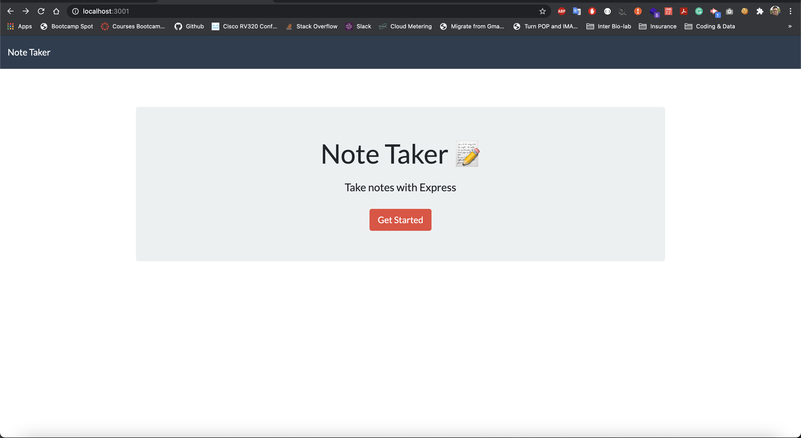
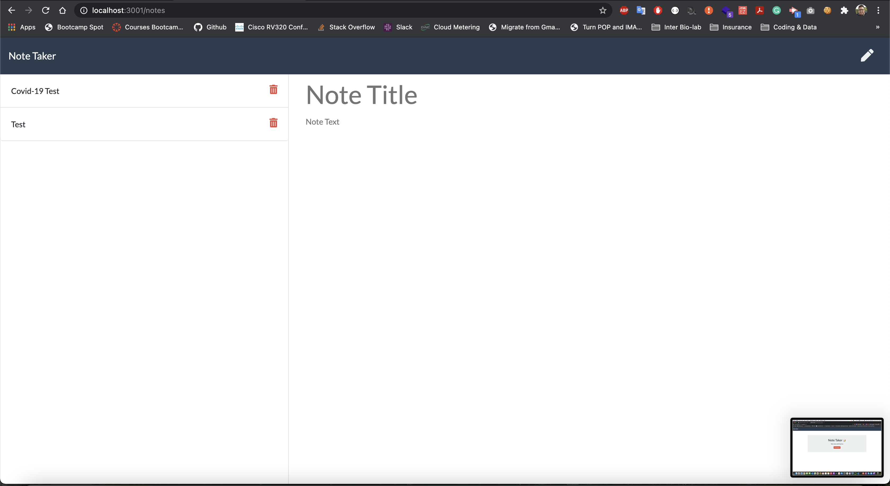

# 11-Express.js-Challenge - Note Taker


## Table of Contents

* [Description](#Description)
* [Requirements](#Requirements)
* [Installation](#Installation)
* [Usage](#Usage)
* [Test](#Test)
* [License](#License)
* [Badges](#Badges)
* [Issues](#Issues)
* [Technologies](#Technologies)
* [Screenshot](#screenshot)
* [Deployment](#deployment)
* [Contributing](#Contributing)
</br>
</br>

## Description
A Express.js server deployed on Heroku to a take note page.
<br>
<br>

## Requirements
#### User Story
>AS A small business owner, I WANT to be able to write and save notes. SO THAT I can organize my thoughts and keep track of tasks I need to complete
<br>

>GIVEN a note-taking application
<br>

>WHEN I open the Note Taker<br>
>>THEN I am presented with a landing page with a link to a notes page<br>

>WHEN I click on the link to the notes page<br>
>>THEN I am presented with a page with existing notes listed in the left-hand column, plus empty fields to enter a new note title and the note’s text in the right-hand column<br>

>WHEN I enter a new note title and the note’s text<br>
>>THEN a Save icon appears in the navigation at the top of the page<br>

>WHEN I click on the Save icon<br>
>>THEN the new note I have entered is saved and appears in the left-hand column with the other existing notes<br>

>WHEN I click on an existing note in the list in the left-hand column<br>
>>THEN that note appears in the right-hand column<br>

>WHEN I click on the Write icon in the navigation at the top of the page<br>
>>THEN I am presented with empty fields to enter a new note title and the note’s text in the right-hand column<br>

<br>
<br>

## Installation
To use this application, please install: 
```
npm install inquirer
npm init
npm install
npm install uuidv4
npm i express
```

<br/>
<br/>

## Test
To run tests on the application, install
```
insomnia.rest
```

<br/>
<br/>

## Usage
After cloning the repo and installing the required npm packages, use the command line to navigate to the root of the application and run node server.js .
<br/>
<br/>

## License 
[](https://opensource.org/licenses/MIT)
</br>
</br>

## Badges


</br>
</br>

## Issues
[](https://GitHub.com/jorgeebn16/10-Object-Oriented-Programming-Challenge/issues/)
[](https://GitHub.com/jorgeebn16/10-Object-Oriented-Programming-Challenge/issues?q=is%3Aissue+is%3Aclosed)
</br>
</br>

## Technologies
* [HTML5](https://developer.mozilla.org/en-US/docs/Web/Guide/HTML/HTML5)
* [CSS](https://developer.mozilla.org/en-US/docs/Web/CSS)
* [Javascript](https://developer.mozilla.org/en-US/docs/Web/JavaScript)
* [jQuery](https://jquery.com/)
* [Bootstrap](https://getbootstrap.com/)
* [npm](https://www.npmjs.com/)
* [Express.js](https://expressjs.com/)
<br/>
<br/>

## Screenshot


</br>
</br>

## Deployment
View the deployed page at [Heroku](https://jorgeebn16-notetaker.herokuapp.com/)
</br>
</br>

## Contributing
[](https://GitHub.com/Naereen/jorgeebn16/11-Express.js-Challenge/graphs/contributors/)

For anyone who wishes to contribute you can contact me with at jorgeebn16@gmail.com
</br>
</br>

Would you like to reach me?
</br>
Contact Me:

Github: https://github.com/jorgeebn16
Email: jorgeebn16@gmail.com


## Issues
[](https://GitHub.com/jorgeebn16/11-Express.js-Challenge/issues/)
[](https://GitHub.com/jorgeebn16/11-Express.js-Challenge/issues?q=is%3Aissue+is%3Aclosed)

